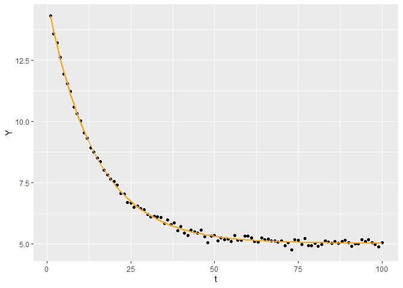
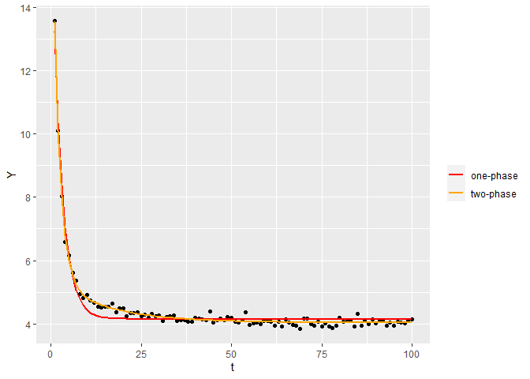

Fitting one-phase and two-phase exponential decays
================
XF
1/11/2022

# 1. Fit data with a one-phase exponential model

Y = span \* e^(-k \* t) + plateau

`span` is the difference between the start point and plateau in y axis  
`k` is the rate constant  
`plateau` is the Y value at infinite times

## 1.1 Simulate data

``` r
data_1 <-  data.frame(t = seq(100),
                      Y = 10 * exp(-0.07 * seq(100)) + 5 + rnorm(100, mean = 0, sd = 0.1))
```

## 1.2 Use `nls` by guessing the single starting value

``` r
# Select an approximate span, must be lower than min(A), and greater than zero
plateau_guess <- min(data_1$Y) * 0.5

# Estimate the rest parameters using a linear model
model_guess <- lm(log(Y - plateau_guess) ~ t, data = data_1)
span_guess <- exp(coef(model_guess)[1])
k_guess <- -coef(model_guess)[2]

# Starting parameters for the linear model
start <-
  list(span = span_guess,
       k = k_guess,
       plateau = plateau_guess)

# Fit the model (with estimated starting parameters)
fit_1 <-
  nls(Y ~ span * exp(-k * t) + plateau,
      data = data_1,
      start = start)

fit_1
```

    ## Nonlinear regression model
    ##   model: Y ~ span * exp(-k * t) + plateau
    ##    data: data_1
    ##    span       k plateau 
    ## 9.98508 0.07016 5.00193 
    ##  residual sum-of-squares: 0.9815
    ## 
    ## Number of iterations to convergence: 8 
    ## Achieved convergence tolerance: 9.302e-09

### Get fit parameters

``` r
tidy(fit_1)
```

    ## # A tibble: 3 x 5
    ##   term    estimate std.error statistic   p.value
    ##   <chr>      <dbl>     <dbl>     <dbl>     <dbl>
    ## 1 span      9.99    0.0573       174.  6.20e-123
    ## 2 k         0.0702  0.000702      99.9 1.22e- 99
    ## 3 plateau   5.00    0.0152       329.  1.20e-149

### Plot fit

``` r
# Use broom’s augment function to get predicted data
preds <- augment(fit_1)
ggplot() +
  geom_point(aes(t, Y), data_1) +
  geom_line(aes(t, .fitted), preds, colour = "orange", size = 1)
```

<!-- -->

## 1.3 Use `nls.multstart`: a gridstart approach with multiple starting parameters

This method uses a random-search/shotgun approach to fit multiple
curves. Random start parameter values are picked from a uniform
distribution between start\_lower() and start\_upper() for each
parameter. If the best model is not improved upon (in terms of AIC
score) for 100 new start parameter combinations, the function will
return that model fit.

Reference: <https://github.com/cran/nls.multstart>

### Run nls\_multstart with gridstart approach

``` r
fit_1 <- nls_multstart(
          Y ~ span * exp(-k * t) + plateau,
          data = data_1,
          iter = 100,
          start_lower = c(span = 10, k = 0.001, plateau = 4),
          start_upper = c(span = 15, k = 0.01, plateau = 8),
          supp_errors = 'Y',
          lower = c(span = 0, k = 0.001, platea = 0)
        )

fit_1
```

    ## Nonlinear regression model
    ##   model: Y ~ span * exp(-k * t) + plateau
    ##    data: data
    ##    span       k plateau 
    ## 9.98508 0.07016 5.00193 
    ##  residual sum-of-squares: 0.9815
    ## 
    ## Number of iterations to convergence: 11 
    ## Achieved convergence tolerance: 1.49e-08

### Get fit parameters

``` r
tidy(fit_1)
```

    ## # A tibble: 3 x 5
    ##   term    estimate std.error statistic   p.value
    ##   <chr>      <dbl>     <dbl>     <dbl>     <dbl>
    ## 1 span      9.99    0.0573       174.  6.20e-123
    ## 2 k         0.0702  0.000702      99.9 1.22e- 99
    ## 3 plateau   5.00    0.0152       329.  1.20e-149

### Plot fit

``` r
preds <- augment(fit_1)
ggplot() +
  geom_point(aes(t, Y), data_1) +
  geom_line(aes(t, .fitted), preds, colour = "orange", size = 1)
```

<!-- -->

# 2. Fit data with a two-phase exponential model

Y = span\_fast \* e^(-k\_fast \* t) + span\_slow \* e^(-k\_slow \* t) +
plateau

`k_fast` and `k_slow` are the two rate constants  
`span_fast` and `span_slow` are the differences between the start points
(either fast component or slow component) and plateau in y axis  
`plateau` is the Y value at infinite times

## 2.1 Simulate data

``` r
data_2 <-  data.frame(t = seq(100),
                      Y = 14 * exp(-0.5 * seq(100)) +
                      1 * exp(-0.05 * seq(100)) +
                      4 + rnorm(100, mean = 0, sd = 0.1))
```

## Use `nls.multstart`: a gridstart approach with multiple starting parameters

``` r
fit_2 <- nls_multstart(Y ~ alpha * exp(-beta * t) + gamma * exp(-delta * t) + theta,
                       data = data_2,
                       iter = 100,
                       start_lower = c(alpha=10, beta=0.01, gamma=0, delta=0.01, theta=4),
                       start_upper = c(alpha=15, beta=1, gamma=5, delta=1, theta=8),
                       supp_errors = 'Y',
                       lower = c(alpha=0, beta=0.001, gamma=0, delta=0.001, theta=0))
fit_2
```

    ## Nonlinear regression model
    ##   model: Y ~ alpha * exp(-beta * t) + gamma * exp(-delta * t) + theta
    ##    data: data
    ##    alpha     beta    gamma    delta    theta 
    ## 13.96031  0.52770  1.36724  0.06503  4.03528 
    ##  residual sum-of-squares: 0.8656
    ## 
    ## Number of iterations to convergence: 17 
    ## Achieved convergence tolerance: 1.49e-08

If you run this step multiple times, you will notice that the order of
the term with alpha and beta and the term with gamma and delta can be
interchanged because of the ramdom starting parameters. You may want to
set the term with a larger decay constant as span\_fast and k\_fast as
below.

### Get fit parameters

``` r
## set the term with a larger decay constant as span_fast and k_fast
if (coef(fit_2)['beta'] > coef(fit_2)['delta']) {
  span_fast <- coef(fit_2)['alpha']
  k_fast <- coef(fit_2)['beta']
  span_slow <- coef(fit_2)['gamma']
  k_slow <- coef(fit_2)['delta']
} else {
  span_fast <- coef(fit_2)['gamma']
  k_fast <- coef(fit_2)['delta']
  span_slow <- coef(fit_2)['alpha']
  k_slow <- coef(fit_2)['beta']
}
plateau <- coef(fit_2)['theta']

names(span_fast) <- 'span_fast'
names(k_fast) <- 'k_fast'
names(span_slow) <- 'span_slow'
names(k_slow) <- 'k_slow'
names(plateau) <- 'plateau'

# Get the sum of the squared residuals.
ssr <- sum(resid(fit_2) ^ 2)
names(ssr) <- 'ssr'

# Return all coefficients
coefficients <- c(span_fast, k_fast, span_slow, k_slow, plateau, ssr)
coefficients
```

    ##   span_fast      k_fast   span_slow      k_slow     plateau         ssr 
    ## 13.96031118  0.52769749  1.36723770  0.06502973  4.03528014  0.86563960

## 2. Comparing one-phase and two-phase exponential models

``` r
# Fit data_2 with a one-phase exponential model
fit_1 <- nls_multstart(
          Y ~ span * exp(-k * t) + plateau,
          data = data_2,
          iter = 100,
          start_lower = c(span = 10, k = 0.001, plateau = 4),
          start_upper = c(span = 15, k = 0.01, plateau = 8),
          supp_errors = 'Y',
          lower = c(span = 0, k = 0.001, platea = 0)
        )

# Compare two models with anova()
anova(fit_1, fit_2)
```

    ## Analysis of Variance Table
    ## 
    ## Model 1: Y ~ span * exp(-k * t) + plateau
    ## Model 2: Y ~ alpha * exp(-beta * t) + gamma * exp(-delta * t) + theta
    ##   Res.Df Res.Sum Sq Df Sum Sq F value    Pr(>F)    
    ## 1     97     3.5584                                
    ## 2     95     0.8656  2 2.6928  147.76 < 2.2e-16 ***
    ## ---
    ## Signif. codes:  0 '***' 0.001 '**' 0.01 '*' 0.05 '.' 0.1 ' ' 1

The result shows a Df of 2 (indicating that the more complex model has
two additional parameters), and the p-value is small(&lt; 0.001). This
means that adding the two additional parameters to the two-phase
exponential model did lead to a significantly improved fit over the
one-phase exponential model.

### Plot fits

``` r
preds_1 <- augment(fit_1)
preds_2 <- augment(fit_2)
ggplot() +
  geom_point(aes(t, Y), data_2) +
  geom_line(aes(t, .fitted, colour="one-phase"), preds_1, size= 1)+
  geom_line(aes(t, .fitted, colour="two-phase"), preds_2, size= 1)+
  scale_color_manual(name = "", values = c("one-phase" = "red", "two-phase" = "orange"))
```

<!-- -->
